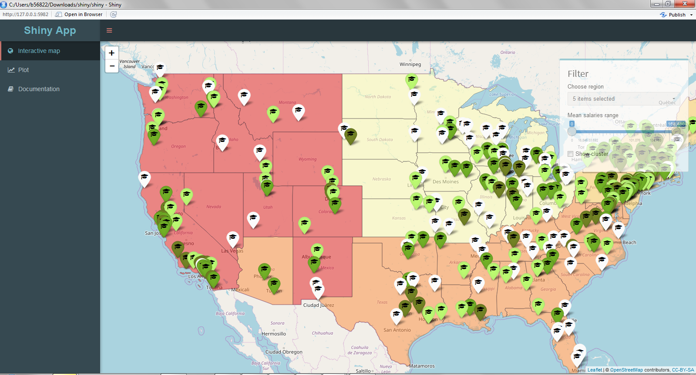

<!-- Limit image width and height -->

<!-- Center image on slide -->

## Project Objective

Nowadays, there are so many university choices that making decision is hard especially at a very young age. Students have to do extra work to research for the best university and even if they did, sometimes the informations gathered are still not enough to make the right decision. A lot of students regretted their choices after they enrolled in the university. Therefore we wanted to solve this problem by creating a shiny app that can help prospect student to make a right decision that will determine their next 5 years of student life.

Goal:

>1. To create shiny app that can help student to find out which university or college suit them the most based on their preferral( location, school type, salary range ).

>2. To create a shiny app that can show a plot of salary increase accross time so that student know what salary range to expect after graduating.

---

## Project Flow

>1. Getting the data :  
  The datasets that we used come from Kaagle "Where it pays to attend college".  
  Link: https://www.kaggle.com/wsj/college-salaries.  
  There are 3 datasets all together.
 
>2. Clean the data:  
  > a. To clean the data, we first converted some of the value to the right format.  
  > b. Arranged columns and merged overlapping file together.  
  > c. Replace all missing values with relevant values.  
  > d. Use tidyr package to tidy the data.

>3. Create Shiny  
> a. Create ui (slider input, checkbox input, tab, etc.)  
> b. Creates server (leaflet, plot,chart,visualization)

---

## Data Set Description

The dataset was originally obtained from the Wall Street Journal based on data from Payscale, Inc.
Contains 3 files:  

> 1. Salaries-by-college-type.csv: 
Contains information on School Name, School Type, Salary Information. We use this informations to     create a plot that can compare salary range between Schools(University) and also School Type.

> 2. Salaries-by-Region.csv: 
Contains the School Name, region and Salary Information. We use this information to create a leaflet plot to show the location of the university on a map. 

> 3. Degrees-that-Pay-Back.csv:  
Contains information such as Major and Salary Information. We use this information in our shiny app to shows the salary information for each undergraduate major.

---

## Shiny Application

Link to Shiny Application: https://lynxvol.shinyapps.io/University_Choices/  
Link to GitHub: 

